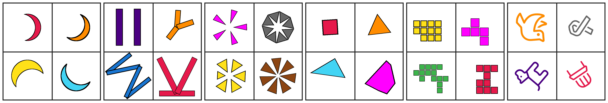
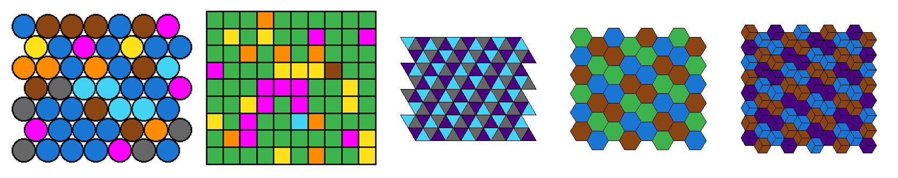

# SPHINX

> **Accepted at the 2026 IEEE/CVF Conference on Computer Vision and Pattern Recognition - FINDINGS Track (CVPRF).**

SPHINX is a synthetic environment for visual perception and reasoning. It
combines procedurally generated motifs, tilings, charts, icons, and geometric
primitives into 25 benchmark tasks with verifiable answers, enabling both
precise evaluation and large-scale training data generation for multimodal
models.

<p align="center">
  <a href="https://maveryn.github.io/sphinx/"></a>
  <a href="https://arxiv.org/abs/2511.20814"></a>
  <a href="https://huggingface.co/datasets/maveryn/sphinx"></a>
  <a href="https://huggingface.co/collections/maveryn/sphinx-models"></a>
  <a href="https://maveryn.github.io/sphinx/demo/"></a>
</p>

<p align="center">
  
  
</p>

## Highlights

- 25 procedurally generated visual reasoning tasks with verifiable answers
- 32,000 training examples and 2,500 evaluation examples
- A large human-model gap on controlled multimodal reasoning tasks
- Released generator code, dataset, project page, interactive demo, and model checkpoints

## Resources

| Resource | Link |
| --- | --- |
| Project page | https://maveryn.github.io/sphinx/ |
| Interactive demo | https://maveryn.github.io/sphinx/demo/ |
| Paper | https://arxiv.org/abs/2511.20814 |
| Dataset | https://huggingface.co/datasets/maveryn/sphinx |
| Models collection | https://huggingface.co/collections/maveryn/sphinx-models |
| Qwen3 4B model | https://huggingface.co/maveryn/sphinx-qwen3-4b |
| Qwen3 8B model | https://huggingface.co/maveryn/sphinx-qwen3-8b |

## Repository Layout

| Path | Description |
| --- | --- |
| `src/sphinx/` | Generator library under the `sphinx` namespace |
| `benchmark/table1/` | Summary TSVs for the main benchmark table |
| `benchmark/table3/` | Summary TSV for the RLVR benchmark table |
| `demo/` | Published 200-example static subset and demo build utilities |
| `tests/` | Registry and generation smoke tests |
| `docs/` | Generated project page and interactive demo for GitHub Pages |

This repo is intentionally scoped to the 25 SPHINX benchmark tasks. Scratch
tasks, unused benchmark scripts, and extra source notes from the original
`mmr_gym` workspace are not included.

## Installation

Use a clean Python environment because this package uses the `sphinx` import
namespace.

```bash
git clone https://github.com/maveryn/sphinx.git
cd sphinx
pip install -e .
```

## Quickstart

List the 25 supported task names:

```bash
python -m sphinx.generate --list-tasks
```

Generate task-specific examples:

```bash
python -m sphinx.generate \
  --out generated/tasks \
  --samples-per-task 10 \
  --tasks charts_pie shape_count transform_pair_infer
```

Generate a random sample:

```bash
python -m sphinx.engine --n 100 --out generated/random --workers 4
```

Generate smoke-test samples for all 25 tasks:

```bash
python -m sphinx.smoke --out smoke_outputs --samples-per-task 25 --seed 42
```

This writes:

- `smoke_outputs/<task>/sample_XXXX.png`
- `smoke_outputs/<task>/metadata.jsonl`
- `smoke_outputs/<task>/contact_sheet.png`
- `smoke_outputs/summary.json`

Generate a subset of tasks:

```bash
python -m sphinx.smoke \
  --out smoke_outputs_subset \
  --samples-per-task 25 \
  --tasks charts_pie shape_count transform_pair_infer
```

By default, `sphinx.generate` uses a faster retry policy for expensive tasks.
If you want the original full retry behavior, add `--full-retries`.

Installed console scripts are also available after `pip install -e .`:

```bash
sphinx-generate --list-tasks
sphinx-smoke --out smoke_outputs
```

## Tests

Run the lightweight test suite:

```bash
pytest
```

The tests cover:

- exact registration of the 25 SPHINX tasks
- consistency between the icon manifest and the shipped SVG subset
- one-example generation smoke checks for representative tasks

For a full 25-task generation check, run:

```bash
python -m sphinx.smoke --out smoke_outputs --samples-per-task 25
```

## Citation

If you use SPHINX, please cite:

```bibtex
@inproceedings{alam2026sphinx,
  author    = {Md Tanvirul Alam and Saksham Aggarwal and Justin Yang Chae and Nidhi Rastogi},
  title     = {SPHINX: A Synthetic Environment for Visual Perception and Reasoning},
  booktitle = {2026 IEEE/CVF Conference on Computer Vision and Pattern Recognition- FINDINGS Track (CVPRF)},
  year      = {2026}
}
```
